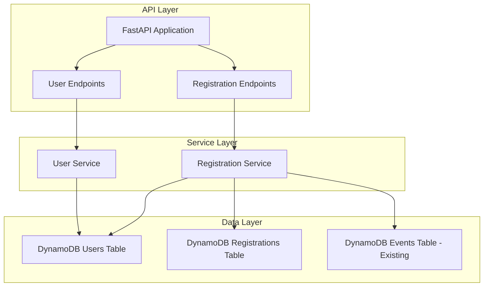

# Design Document: User Registration System

## Overview

This design document describes the architecture and implementation of a user registration system for the Event Management API. The system enables users to register for events, handles capacity constraints with optional waitlist support, and allows users to view their registered events.

The system extends the existing FastAPI-based Event Management API and uses DynamoDB for data persistence.

## Architecture



The architecture follows a layered approach:
- **API Layer**: FastAPI endpoints for HTTP request handling
- **Service Layer**: Business logic for user and registration operations
- **Data Layer**: DynamoDB tables for persistence

## Components and Interfaces

### API Endpoints

#### User Endpoints
| Method | Path | Description |
|--------|------|-------------|
| POST | /users | Create a new user |
| GET | /users/{user_id} | Get user by ID |
| GET | /users/{user_id}/registrations | List user's registered events |

#### Registration Endpoints
| Method | Path | Description |
|--------|------|-------------|
| POST | /events/{event_id}/register | Register user for event |
| DELETE | /events/{event_id}/register/{user_id} | Unregister user from event |
| GET | /events/{event_id}/registrations | List event registrations |
| PUT | /events/{event_id}/waitlist | Configure waitlist settings |

### Service Interfaces

```python
class UserService:
    def create_user(user_data: UserCreate) -> User
    def get_user(user_id: str) -> User
    def get_user_registrations(user_id: str) -> List[UserRegistration]

class RegistrationService:
    def register_user(event_id: str, user_id: str) -> Registration
    def unregister_user(event_id: str, user_id: str) -> None
    def get_event_registrations(event_id: str) -> EventRegistrations
    def configure_waitlist(event_id: str, enabled: bool) -> Event
```

## Data Models

### User Model
```python
class User(BaseModel):
    userId: str                    # Unique identifier
    name: str                      # User's display name
    createdAt: str                 # ISO timestamp of creation
```

### UserCreate Model (Input)
```python
class UserCreate(BaseModel):
    userId: Optional[str] = None   # Optional, auto-generated if not provided
    name: str                      # Required, non-empty
```

### Registration Model
```python
class Registration(BaseModel):
    eventId: str                   # Event identifier
    userId: str                    # User identifier
    status: str                    # "registered" or "waitlisted"
    waitlistPosition: Optional[int] # Position if waitlisted
    registeredAt: str              # ISO timestamp
```

### UserRegistration Model (Response)
```python
class UserRegistration(BaseModel):
    eventId: str
    eventTitle: str
    eventDate: str
    status: str                    # "registered" or "waitlisted"
    waitlistPosition: Optional[int]
    registeredAt: str
```

### Event Extension
The existing Event model is extended with:
```python
waitlistEnabled: bool = False      # Whether waitlist is enabled
registeredCount: int = 0           # Current registration count
waitlistCount: int = 0             # Current waitlist count
```

### DynamoDB Table Schemas

#### Users Table
- Partition Key: `userId` (String)
- Attributes: `name`, `createdAt`

#### Registrations Table
- Partition Key: `eventId` (String)
- Sort Key: `userId` (String)
- GSI: `userId-index` (Partition: `userId`) for querying user's registrations
- Attributes: `status`, `waitlistPosition`, `registeredAt`

## Correctness Properties

*A property is a characteristic or behavior that should hold true across all valid executions of a system-essentially, a formal statement about what the system should do. Properties serve as the bridge between human-readable specifications and machine-verifiable correctness guarantees.*

Based on the prework analysis, the following properties have been identified. Redundant properties have been consolidated.

### Property 1: User creation preserves data
*For any* valid user creation request with a non-empty name, the created user SHALL contain the same name and a valid userId (either provided or auto-generated) and a createdAt timestamp.
**Validates: Requirements 1.1, 1.2, 1.4**

### Property 2: Whitespace-only names are rejected
*For any* string composed entirely of whitespace characters, attempting to create a user with that name SHALL result in a validation error.
**Validates: Requirements 1.3**

### Property 3: Auto-generated userIds are unique
*For any* sequence of user creations without explicit userIds, each generated userId SHALL be unique.
**Validates: Requirements 1.2**

### Property 4: Registration count consistency
*For any* event and sequence of registrations/unregistrations, the registeredCount SHALL equal the number of users with status "registered" for that event.
**Validates: Requirements 3.1, 4.1**

### Property 5: Capacity enforcement without waitlist
*For any* event with waitlistEnabled=false and registeredCount equal to capacity, attempting to register a new user SHALL result in rejection.
**Validates: Requirements 2.2, 3.2**

### Property 6: Waitlist addition when full
*For any* event with waitlistEnabled=true and registeredCount equal to capacity, registering a new user SHALL add them to the waitlist with a position equal to (current waitlistCount + 1).
**Validates: Requirements 2.1, 3.3**

### Property 7: No duplicate registrations
*For any* user already registered or waitlisted for an event, attempting to register again SHALL result in a duplicate registration error.
**Validates: Requirements 3.4**

### Property 8: Waitlist promotion on unregistration
*For any* event with a non-empty waitlist, when a registered user unregisters, the first waitlisted user SHALL be promoted to registered status.
**Validates: Requirements 4.2**

### Property 9: Waitlist position consistency
*For any* event with waitlisted users, after removing a user from the waitlist, all remaining waitlist positions SHALL be consecutive starting from 1.
**Validates: Requirements 4.3**

### Property 10: User registrations list completeness
*For any* user with registrations, querying their registrations SHALL return all events they are registered or waitlisted for, with correct status for each.
**Validates: Requirements 5.1, 5.2**

### Property 11: Registration data round-trip
*For any* valid Registration object, serializing to JSON and deserializing SHALL produce an equivalent object.
**Validates: Requirements 6.1, 6.2**

## Error Handling

### HTTP Status Codes
| Status | Condition |
|--------|-----------|
| 200 | Successful GET, PUT, DELETE |
| 201 | Successful POST (creation) |
| 400 | Invalid input (empty name, invalid format) |
| 404 | User or Event not found |
| 409 | Duplicate registration, Event full (no waitlist) |
| 500 | Database or unexpected errors |

### Error Response Format
```json
{
    "detail": "Human-readable error message"
}
```

### Specific Error Messages
- `"User not found"` - userId doesn't exist
- `"Event not found"` - eventId doesn't exist
- `"Event is full"` - capacity reached, no waitlist
- `"Already registered for this event"` - duplicate registration
- `"Not registered for this event"` - unregister without registration
- `"Name cannot be empty or whitespace only"` - invalid name

## Testing Strategy

### Property-Based Testing Framework
The system will use **Hypothesis** for Python property-based testing. Hypothesis is well-suited for FastAPI applications and integrates with pytest.

### Test Configuration
- Minimum 100 iterations per property test
- Each property test tagged with: `**Feature: user-registration, Property {number}: {property_text}**`

### Unit Tests
Unit tests will cover:
- Input validation edge cases
- API endpoint response formats
- Error handling paths
- DynamoDB interaction mocking for isolation

### Property-Based Tests
Each correctness property will have a corresponding property-based test:

1. **Property 1 Test**: Generate random valid names, create users, verify data preservation
2. **Property 2 Test**: Generate whitespace-only strings, verify rejection
3. **Property 3 Test**: Create multiple users without IDs, verify uniqueness
4. **Property 4 Test**: Generate registration/unregistration sequences, verify count consistency
5. **Property 5 Test**: Fill events without waitlist, verify rejection
6. **Property 6 Test**: Fill events with waitlist, verify waitlist positions
7. **Property 7 Test**: Register users twice, verify duplicate rejection
8. **Property 8 Test**: Set up full events with waitlist, unregister, verify promotion
9. **Property 9 Test**: Manipulate waitlists, verify position consistency
10. **Property 10 Test**: Register users for multiple events, verify list completeness
11. **Property 11 Test**: Generate Registration objects, verify JSON round-trip

### Test Data Generators
Custom Hypothesis strategies for:
- Valid user names (non-empty, non-whitespace)
- Valid userIds (UUID format)
- Event configurations (capacity, waitlist settings)
- Registration sequences
